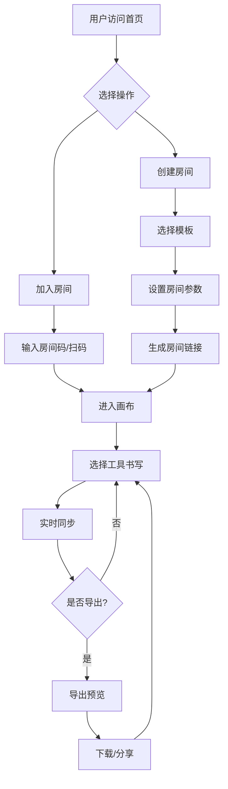

# 涂鸦签名工具 - 产品需求文档

## 1. 产品概述

一款面向毕业、聚会、纪念活动等场景的在线多人协作涂鸦签名工具，核心目标是还原"像在校服或纪念册上用记号笔自由签名"的真实体验，让用户能够跨越空间限制，共同在一块虚拟画布上留下手写痕迹。

**目标用户**：毕业生及校友、婚礼/生日派对宾客、团队成员、活动组织者等需要集体手写留念的人群。

**核心价值**：无需下载App，通过扫码或链接即可进入专属画布房间，支持多人实时协作书写，提供丰富的书写工具和装饰元素，最终可导出高清图片或PDF制作实体纪念册。

## 2. 核心功能

### 2.1 用户角色

| 角色 | 注册方式 | 核心权限 |
|------|----------|----------|
| 游客 | 无需注册 | 可匿名参与房间涂鸦，查看只读分享 |
| 注册用户 | 邮箱/手机快速注册 | 创建房间、管理房间设置、实名签名、高清导出 |
| 房主 | 注册用户 | 锁定画布、管理参与者、设置房间权限、删除内容 |

### 2.2 功能模块

1. **首页/landing页**：创建房间、加入房间入口、模板选择、活动介绍
2. **画布编辑页**：核心协作画布、工具栏、参与者列表、设置面板
3. **房间管理面板**：房间设置、访问控制、参与人员管理
4. **导出预览页**：全画布/局部导出预览、格式选择、尺寸设置
5. **分享设置页**：链接管理、二维码生成、权限配置

### 2.3 页面详细说明

#### 首页 (/)
| 模块名称 | 功能描述 |
|----------|----------|
| Hero区域 | 温馨的毕业/聚会场景动效背景，展示"共同留下美好回忆"标语 |
| 创建房间 | 选择模板、设置房间名称、创建专属房间获取链接 |
| 加入房间 | 输入房间码或扫码加入已有房间 |
| 模板展示 | 展示可用的背景模板（毕业主题、校服样式、空白画布、婚礼风格等） |
| 功能介绍 | 展示核心功能：多人协作、丰富工具、导出分享 |

#### 画布编辑页 (/room/[roomId])
| 模块名称 | 功能描述 |
|----------|----------|
| 工具栏 | 马克笔、荧光笔、钢笔、毛笔、喷漆、橡皮擦、撤销/重做、颜色选择、粗细调节 |
| 画布区域 | 可横向扩展的大尺寸画布，支持背景模板，显示所有参与者的笔迹 |
| 装饰面板 | 贴纸（爱心、星星、毕业帽等）、印章、小照片插入 |
| 参与者列表 | 显示当前在线用户及光标颜色，点击可定位 |
| 设置菜单 | 锁定画布、切换匿名/实名模式、画布缩放、重置画布 |
| 分享按钮 | 快速分享房间链接或二维码 |

#### 房间管理面板（弹窗）
| 模块名称 | 功能描述 |
|----------|----------|
| 基本设置 | 房间名称、描述、模板选择 |
| 访问控制 | 公开/密码/邀请码模式设置 |
| 参与者管理 | 查看在线/离线人员、移除参与者 |
| 权限设置 | 参与人数上限、画布锁定状态、保存有效期 |
| 删除房间 | 房主可永久删除房间 |

#### 导出预览页 (/export/[roomId])
| 模块名称 | 功能描述 |
|----------|----------|
| 导出预览 | 全画布或框选区域预览，支持缩放查看 |
| 格式选择 | PNG、JPG、SVG、PDF格式 |
| 尺寸设置 | 适配屏幕、A4打印册、实体纪念册等预设尺寸 |
| 下载按钮 | 一键下载或生成分享链接 |

## 3. 核心流程

### 3.1 用户主要流程

**创建房间流程**：
1. 用户访问首页
2. 选择背景模板
3. 设置房间名称和访问权限
4. 点击创建房间
5. 系统生成房间ID和分享链接
6. 用户可复制链接或生成二维码分享

**加入房间流程**：
1. 用户通过链接或扫码进入房间
2. 输入昵称（可选择匿名或登录后实名）
3. 等待画布加载完成
4. 开始在画布上书写

**协作书写流程**：
1. 用户选择书写工具和颜色
2. 在画布上触摸/点击拖动进行书写
3. 笔迹实时同步到所有参与者
4. 其他参与者可看到光标位置和昵称
5. 支持撤销自己的笔迹

**导出流程**：
1. 房主或注册用户点击导出按钮
2. 选择导出区域（全部或框选）
3. 选择格式和尺寸
4. 预览确认后下载

### 3.2 流程图

## 4. 用户界面设计

### 4.1 设计风格

**整体定位**：温馨、有仪式感、充满情感共鸣的纪念性工具

**色彩方案**：
- 主色调：温暖的珊瑚橙 (#FF6B6B) 搭配柔和的奶油白 (#FFF5E6)
- 辅助色：复古蓝绿 (#4ECDC4) 用于工具激活态
- 强调色：金色 (#FFD93D) 用于重要按钮和高亮
- 背景色：温暖的米色渐变 (#FFF9F0 → #FFF5E6)
- 文字色：深棕色 (#3D3D3D) 传递温馨感

**按钮风格**：
- 圆角设计 (border-radius: 16px-24px)
- 柔和阴影营造立体感
- hover时有轻微上浮动画
- 主要按钮使用渐变色

**字体选择**：
- 标题：甜蜜时光体 (Ma Shan Zheng) 或 站酷快乐体
- 正文：思源黑体 (Noto Sans SC) Regular
- 手写风格区域使用手写字体

**图标风格**：
- 使用圆润、友好的线性图标
- 配合emoji表情增添趣味性
- 笔刷类图标使用毛笔手绘风格

**布局风格**：
- 卡片式布局，模块分明
- 大量留白营造呼吸感
- 顶部固定导航，底部浮动工具栏
- 画布区域最大化，UI元素不遮挡

### 4.2 页面设计概览

**首页布局**：
- 全屏Hero区域带动态粒子/光晕效果
- 中央突出的"创建房间"和"加入房间"按钮
- 底部展示模板卡片轮播
- 整体风格参考 graduation announcement 邀请函设计

**画布页布局**：
- 全屏沉浸式画布
- 左侧竖排工具栏（可折叠）
- 右侧浮动参与者列表（可隐藏）
- 底部中央装饰元素快捷入口
- 顶部右侧设置和分享按钮
- 触摸操作时工具栏自动隐藏以最大化画布

**房间管理弹窗**：
- 居中模态框，半透明背景
- Tab式切换不同设置分类
- 清晰的分区和标签

### 4.3 响应式设计

**桌面端**：
- 画布可横向滚动扩展
- 工具栏常驻显示
- 侧边栏展示完整信息

**平板端**：
- 工具栏浮动显示
- 参与者列表可收起
- 优化触控笔书写体验

**移动端**：
- 工具栏固定在底部
- 单手操作优化
- 手势操作支持（双指缩放、三指撤销）
- 书写时屏蔽页面滚动
- 全屏沉浸模式

### 4.4 交互反馈

**书写体验**：
- 笔迹跟手延迟 < 100ms
- 触点反馈（轻微振动可选）
- 笔迹粗细随速度动态变化
- 荧光笔半透明叠加效果

**视觉反馈**：
- 工具选中态高亮
- 按钮点击涟漪效果
- 撤销成功/失败提示
- 他人书写时光标跟随动画

**情感化设计**：
- 进入房间时的温馨欢迎语
- 完成书写时的彩纸庆祝动画
- 导出成功时的仪式感展示

## 5. 技术需求（非功能性）

### 5.1 性能要求

- 画布渲染帧率：60fps
- 笔迹同步延迟：< 100ms
- 页面加载时间：< 3s
- 支持同时在线人数：单个房间 ≤ 100人
- 画布最大尺寸：10000 x 2000 像素

### 5.2 兼容性要求

- 支持现代浏览器：Chrome, Safari, Firefox, Edge 最新版本
- 移动端：iOS Safari 14+, Android Chrome 90+
- 触控设备：手指、触控笔均支持
- 渐进增强：基础功能全平台可用，高级效果按设备能力降级

### 5.3 安全要求

- 房间访问密码加密传输
- 用户数据隔离存储
- 房主可删除任意内容
- 导出图片包含水印标识

## 6. 产品边界

### 6.1 MVP版本功能范围

**必须实现**：
- 首页和基础房间创建
- 基础画布书写功能
- 马克笔和荧光笔工具
- 颜色选择和粗细调节
- 橡皮擦和撤销功能
- 单房间多人实时协作
- 房间链接分享
- PNG图片导出

**后续迭代**：
- 更多笔刷类型
- 贴纸和印章功能
- 照片插入
- PDF导出
- 二维码生成
- 密码房间
- 画布锁定
- 历史记录回放
- 用户注册系统

### 6.2 不在MVP范围

- 实体纪念册打印服务
- 增值付费功能
- 用户个人主页
- 社交分享到第三方平台
- 离线支持
