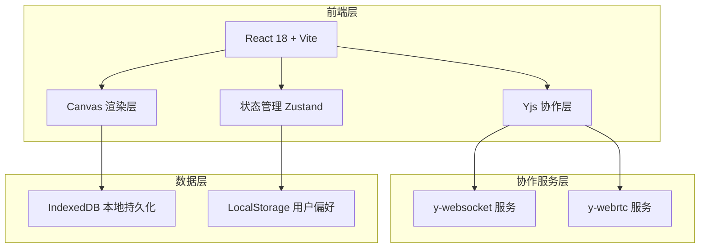
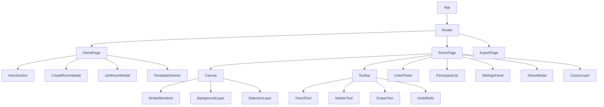

# 涂鸦签名工具 - 技术架构文档

## 1. 架构设计

### 1.1 整体架构



### 1.2 组件架构



## 2. 技术选型

### 2.1 核心技术栈

| 技术 | 版本 | 用途 |
|------|------|------|
| React | 18.x | UI框架 |
| Vite | 5.x | 构建工具 |
| TypeScript | 5.x | 类型安全 |
| TailwindCSS | 3.x | 样式方案 |
| Zustand | 4.x | 状态管理 |
| Yjs | 13.x | 实时协作 |
| y-websocket | 1.x | WebSocket同步 |
| Rough.js | 5.x | 手绘风格渲染 |
| Konva | 9.x | Canvas 2D 增强 |
| react-konva | 18.x | React Canvas 绑定 |
| react-hot-toast | 2.x | 提示消息 |
| framer-motion | 11.x | 动画效果 |
| html2canvas | 1.x | 导出功能 |
| jspdf | 2.x | PDF导出 |

### 2.2 开发工具

| 工具 | 用途 |
|------|------|
| ESLint | 代码检查 |
| Prettier | 代码格式化 |
| Git | 版本控制 |

## 3. 路由定义

| 路由 | 页面 | 功能描述 |
|------|------|----------|
| `/` | HomePage | 首页，房间创建和加入 |
| `/room/:roomId` | RoomPage | 画布协作页面 |
| `/export/:roomId` | ExportPage | 导出预览页面 |
| `/share/:roomId` | SharePage | 只读分享页面 |

## 4. 数据模型

### 4.1 核心数据结构

```typescript
// 房间数据
interface Room {
  id: string;
  name: string;
  template: 'graduation' | 'uniform' | 'blank' | 'wedding' | 'party';
  backgroundUrl?: string;
  isLocked: boolean;
  accessType: 'public' | 'password' | 'invite';
  password?: string;
  maxParticipants: number;
  createdAt: Date;
  expiresAt?: Date;
}

// 用户数据
interface User {
  id: string;
  name: string;
  avatar?: string;
  isAnonymous: boolean;
  cursorColor: string;
}

// 笔迹数据
interface Stroke {
  id: string;
  userId: string;
  tool: 'pencil' | 'marker' | 'highlighter' | 'brush' | 'spray';
  color: string;
  size: number;
  opacity: number;
  points: Point[];
  createdAt: Date;
}

interface Point {
  x: number;
  y: number;
  pressure?: number;
  tiltX?: number;
  tiltY?: number;
}

// 装饰元素
interface Sticker {
  id: string;
  type: string;
  x: number;
  y: number;
  scale: number;
  rotation: number;
}

// 画布状态
interface CanvasState {
  strokes: Stroke[];
  stickers: Sticker[];
  background: string;
  viewPosition: { x: number; y: number };
  zoom: number;
}
```

### 4.2 Yjs 文档结构

```typescript
// Y.Doc 结构
{
  strokes: Y.Array<Stroke>,
  stickers: Y.Array<Sticker>,
  users: Y.Map<User>,
  settings: Y.Map<any>
}
```

### 4.3 本地存储结构

```typescript
// LocalStorage Keys
const STORAGE_KEYS = {
  USER_PREFERENCES: 'doodle-user-prefs',
  RECENT_ROOMS: 'doodle-recent-rooms',
  CURRENT_USER: 'doodle-current-user'
};

// IndexedDB Stores
const DB_STORES = {
  ROOMS: 'rooms',
  STROKES: 'strokes',
  CACHE: 'cache'
};
```

## 5. 组件设计

### 5.1 核心组件

| 组件 | 类型 | 描述 |
|------|------|------|
| App | Container | 根组件，路由配置 |
| HomePage | Page | 首页 |
| RoomPage | Page | 画布页面 |
| Canvas | Container | 画布主容器 |
| DrawingCanvas | Component | 实际绘制的Canvas |
| CursorLayer | Component | 其他用户光标显示 |
| BackgroundLayer | Component | 背景图片层 |
| Toolbar | Container | 工具栏容器 |
| ToolButton | Component | 工具按钮 |
| ColorPicker | Component | 颜色选择器 |
| SizeSlider | Component | 大小调节滑块 |
| ParticipantList | Component | 参与者列表 |
| StickerPanel | Component | 贴纸面板 |
| SettingsModal | Component | 设置弹窗 |
| ShareModal | Component | 分享弹窗 |
| ExportPreview | Component | 导出预览 |

### 5.2 组件 Props 设计

```typescript
// Canvas Props
interface CanvasProps {
  roomId: string;
  isLocked: boolean;
  tool: ToolType;
  color: string;
  size: number;
  onStrokeComplete: (stroke: Stroke) => void;
}

// ToolButton Props
interface ToolButtonProps {
  icon: ReactNode;
  label: string;
  isActive: boolean;
  onClick: () => void;
  disabled?: boolean;
}

// ParticipantList Props
interface ParticipantListProps {
  users: User[];
  currentUserId: string;
  onLocateUser: (userId: string) => void;
}
```

## 6. 协作机制

### 6.1 Yjs 集成方案

```typescript
// 协作初始化
const initCollaboration = (roomId: string) => {
  const ydoc = new Y.Doc();
  const provider = new WebsocketProvider(
    'wss://demos.yjs.dev',
    `doodle-room-${roomId}`,
    ydoc
  );
  
  const strokesArray = ydoc.getArray<Stroke>('strokes');
  const stickersArray = ydoc.getArray<Sticker>('stickers');
  const usersMap = ydoc.getMap<User>('users');
  
  return { ydoc, provider, strokesArray, stickersArray, usersMap };
};
```

### 6.2 光标同步

```typescript
// 光标位置更新
const updateCursor = (x: number, y: number) => {
  awareness.setLocalStateField('cursor', { x, y });
};

// 监听其他用户光标
provider.awareness.on('change', () => {
  const states = provider.awareness.getStates();
  // 更新其他用户光标显示
});
```

### 6.3 离线支持

- 使用 IndexedDB 缓存画布数据
- Yjs 自带离线同步机制
- 网络恢复后自动合并冲突

## 7. 性能优化

### 7.1 Canvas 渲染优化

- 使用 Konva 的分层渲染
- 笔迹绘制使用 requestAnimationFrame
- 长笔迹进行点采样压缩
- 视口外的笔迹不渲染

### 7.2 协作性能

- 使用 Yjs 的增量更新
- 批量同步操作
- 合理设置同步频率

### 7.3 包体积优化

- 动态导入非核心组件
- 图片资源懒加载
- 使用 Tree Shaking

## 8. 项目结构

```
/src
├── /components
│   ├── /canvas
│   │   ├── Canvas.tsx
│   │   ├── DrawingLayer.tsx
│   │   ├── BackgroundLayer.tsx
│   │   └── CursorLayer.tsx
│   ├── /toolbar
│   │   ├── Toolbar.tsx
│   │   ├── ToolButton.tsx
│   │   ├── ColorPicker.tsx
│   │   └── SizeSlider.tsx
│   ├── /room
│   │   ├── ParticipantList.tsx
│   │   ├── SettingsModal.tsx
│   │   └── ShareModal.tsx
│   └── /home
│       ├── HeroSection.tsx
│       ├── CreateRoomForm.tsx
│       └── TemplateSelector.tsx
├── /hooks
│   ├── useCanvas.ts
│   ├── useCollaboration.ts
│   ├── useTools.ts
│   └── useExport.ts
├── /stores
│   ├── canvasStore.ts
│   ├── roomStore.ts
│   └── userStore.ts
├── /types
│   └── index.ts
├── /utils
│   ├── canvas.ts
│   ├── export.ts
│   └── colors.ts
├── /styles
│   └── globals.css
├── App.tsx
└── main.tsx
```

## 9. 开发规范

### 9.1 命名规范

- 组件使用 PascalCase
- hooks 使用 camelCase 以 use 开头
- 常量使用 UPPER_SNAKE_CASE
- 文件夹使用 kebab-case

### 9.2 代码风格

- 使用 TypeScript strict 模式
- 组件优先使用 FC<T> 类型
- 优先使用 const 和箭头函数
- 合理使用 React.memo 优化

### 9.3 Git 规范

- feat: 新功能
- fix: 修复bug
- docs: 文档
- style: 代码格式
- refactor: 重构
- test: 测试
- chore: 构建/工具
